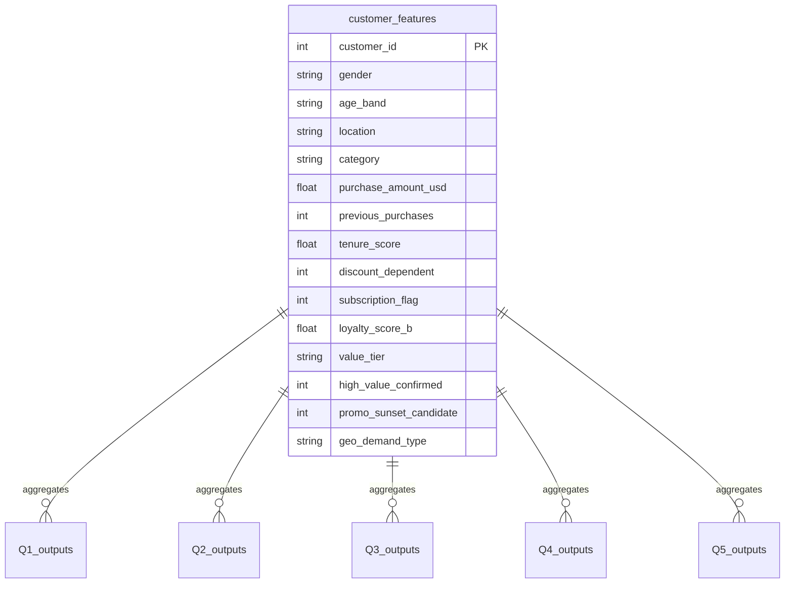

# Power BI Dashboard Specification & Visual Design Plan

> **Project:** Decoding Customer Value — D2C Fashion Brand  
> **Source Files:** `data/features.csv` (Fact Table) · SQL Output CSVs from `reports/sql_outputs/` (Summary Views)  
> **Dashboard Output:** `powerbi/customer_dashboard.pbix` (Single Multi-Page File)

---

## 1. Design System & Aesthetics (Obsidian Slate Theme)

To create a premium, high-impact first impression, the dashboard will utilize a modern **Obsidian Slate Dark Mode** aesthetic. This avoids generic browser-default colors and creates a sleek, executive-level visual hierarchy.

### 1.1 Color Palette Tokens
| Token | HEX Code | Commercial Role |
|---|---|---|
| **Deep Obsidian Background** | `#0F172A` | Background canvas color |
| **Card Card Background** | `#1E293B` | Container background for individual visuals |
| **Organic Emerald** | `#10B981` | Champions, Organic Pull, positive metrics (100% full-price) |
| **Cyber Blue** | `#3B82F6` | Growth tier, Mid-tenure, subscription metrics |
| **Sunset Coral** | `#F43F5E` | Casual tier, Promo-dependent, margin-eroding indicators |
| **Amber Warning** | `#F59E0B` | Promo sunset candidates, at-risk alerts |
| **Muted Slate** | `#64748B` | Underdeveloped states, benchmarks, secondary axis elements |
| **Primary Text** | `#F8FAFC` | Titles, KPI values, high-contrast labels |
| **Secondary Text** | `#94A3B8` | Subtitles, axis labels, legends |

### 1.2 Layout & Typography Guidelines
* **Canvas Size**: 16:9 widescreen layout ($1280 \times 720$ pixels).
* **Typography**: **Segoe UI** (Primary for UI), **DIN** (For numeric KPI cards to match premium reporting standards).
* **Borders**: Borderless visual cards with rounded corners (8px corner radius) and a subtle, dark drop-shadow (`rgba(0, 0, 0, 0.4)` with 12px blur).
* **Spacing**: Consistent 12px padding between cards (grid alignment).

---

## 2. Power BI Custom Theme JSON
Copy and save the code block below as `theme.json`, then import it into Power BI (`View > Themes > Browse for themes`) to automatically apply the custom color system, typography, card shapes, and gridlines.

```json
{
  "name": "Obsidian Slate Dark Mode",
  "dataColors": [
    "#10B981",
    "#3B82F6",
    "#F43F5E",
    "#F59E0B",
    "#64748B",
    "#8B5CF6",
    "#EC4899",
    "#14B8A6"
  ],
  "background": "#0F172A",
  "foreground": "#F8FAFC",
  "tableAccent": "#3B82F6",
  "visualStyles": {
    "*": {
      "*": {
        "background": [
          {
            "show": true,
            "color": { "solid": { "color": "#1E293B" } },
            "transparency": 0
          }
        ],
        "border": [
          {
            "show": false
          }
        ],
        "dropShadow": [
          {
            "show": true,
            "color": { "solid": { "color": "#000000" } },
            "position": "Outer",
            "preset": "Custom",
            "angle": 135,
            "distance": 4,
            "blur": 8,
            "transparency": 60
          }
        ],
        "title": [
          {
            "show": true,
            "fontColor": { "solid": { "color": "#F8FAFC" } },
            "fontFamily": "Segoe UI Semibold",
            "fontSize": 12,
            "alignment": "Left"
          }
        ]
      }
    },
    "card": {
      "*": {
        "labels": [
          {
            "color": { "solid": { "color": "#F8FAFC" } },
            "fontFamily": "DIN",
            "fontSize": 36
          }
        ],
        "categoryLabels": [
          {
            "color": { "solid": { "color": "#94A3B8" } },
            "fontFamily": "Segoe UI",
            "fontSize": 9
          }
        ]
      }
    },
    "categoryCard": {
      "*": {
        "labels": [
          {
            "color": { "solid": { "color": "#F8FAFC" } },
            "fontFamily": "DIN",
            "fontSize": 36
          }
        ]
      }
    }
  }
}
```

---

## 3. Data Model Architecture (Star Schema)

The dashboard will be modeled as a clean **Star Schema** to ensure optimal performance and DAX simplicity. 



### 3.1 Star Schema Relationships
* **Fact Table**: `customer_features` (imported from `data/features.csv`).
* **Dimension/Aggregated Tables**: Q1 to Q5 output CSVs from `reports/sql_outputs/` linked to the fact table via `Location/State` or `Value Tier` where cross-filtering is required, or left as independent summary tables for card-based pages.
* **Relationship Cardinality**: 1-to-many (1 state to many customers) or 1-to-1 (on customer-level summaries).
* **Cross-Filter Direction**: Single (from dimensions to fact) to maintain model integrity.

---

## 4. Key DAX Measures (Dynamic Calculation Layer)

Implement these measures inside Power BI to drive the visual KPIs and charts.

```dax
// 1. Core Cohort Volume
Total Customers = COUNTROWS(customer_features)

// 2. National Averages
Average Previous Purchases = AVERAGE(customer_features[previous_purchases])
Average Spend = AVERAGE(customer_features[purchase_amount_usd])
Average Loyalty Score B = AVERAGE(customer_features[loyalty_score_b])

// 3. Program Penetration Rates
Subscription Rate = DIVIDE(
    CALCULATE(COUNTROWS(customer_features), customer_features[subscription_flag] = 1),
    [Total Customers],
    0
)

Promo Buyer Rate = DIVIDE(
    CALCULATE(COUNTROWS(customer_features), customer_features[discount_dependent] = 1),
    [Total Customers],
    0
)

// 4. Playbook Metrics
Promo Sunset Candidates = CALCULATE(
    COUNTROWS(customer_features), 
    customer_features[promo_sunset_candidate] = 1
)

Ideal Customer Profile (ICP) Count = CALCULATE(
    COUNTROWS(customer_features), 
    customer_features[value_tier] = "Champion",
    customer_features[high_value_confirmed] = 1
)
```

---

## 5. Page-by-Page Visual Design

The dashboard will contain **four interactive pages** targeting specific executive priorities.

---

### Page 1: Executive Customer Pyramid (Loyalty Dashboard)
* **Objective**: Evaluate the shape of the customer base using Framework B and analyze the divergence from the tenure-only baseline.
* **Layout**:

```
+----------------------------------------------------------------------------+
|  [Logo]  EXECUTIVE CUSTOMER PYRAMID (LOYALTY ANALYSIS)     [Filters: State] |
+----------------------------------------------------------------------------+
|  +--------------+  +--------------+  +--------------+  +----------------+  |
|  |  Total Cust. |  |  Avg Purchases|  | Avg Score B  |  | Subscription % |  |
|  |    3,900     |  |    25.35     |  |    44.82     |  |     27.0%      |  |
|  +--------------+  +--------------+  +--------------+  +----------------+  |
+----------------------------------------------------------------------------+
|  +----------------------------------+  +--------------------------------+  |
|  | 1. Customer Pyramid (Funnel)    |  | 2. Framework A vs B Divergence |  |
|  |                                  |  |   (Clustered Bar Chart)        |  |
|  |   Champion (15.5%) -- $61.53     |  |   - Consistent: A-High/B-Champ |  |
|  |   Growth   (55.0%) -- $59.29     |  |   - DIVERGE: A-High/B-NotChamp  |  |
|  |   Casual   (29.5%) -- $59.73     |  |   - DIVERGE: B-Champ/B-NotHigh  |  |
|  +----------------------------------+  +--------------------------------+  |
+----------------------------------------------------------------------------+
|  +----------------------------------------------------------------------+  |
|  | 3. Loyalty Tier & Spend Cross-Tab (Table Visual with Data Bars)       |  |
|  +----------------------------------------------------------------------+  |
+----------------------------------------------------------------------------+
```

* **Visual Details**:
  1. **Customer Pyramid (Funnel Chart)**:
     * *Fields*: Group = `value_tier` (sorted by `value_tier_rank`), Values = `[Total Customers]`. Tooltip: `[Average Spend]`.
     * *Colors*: Champion = `Organic Emerald`, Growth = `Cyber Blue`, Casual = `Sunset Coral`.
  2. **Framework A vs. B Divergence (Clustered Column Chart)**:
     * *Source*: SQL Q1 Result Set 3 (`framework_divergence`).
     * *Fields*: X-Axis = `divergence_type`, Y-Axis = `customer_count`. Tooltip: `discount_rate_pct`, `subscription_rate_pct`.
     * *Coloring*: Highlight the `DIVERGE: A-High but NOT B-Champion` column in `Amber Warning` (172 candidates) to show the promo-sunset candidates.
  3. **Performance Matrix (Table Visual)**:
     * *Fields*: Rows = `value_tier`, Columns = `buyer_type`. Measures = `[Total Customers]`, `[Average Previous Purchases]`, `[Average Spend]`.
     * *Formatting*: Apply conditional formatting data bars to `[Average Previous Purchases]` and a heat map background to `[Total Customers]`.

---

### Page 2: Promotional Restructure & Margin Recovery
* **Objective**: Profile promo-dependent buyers and track the subscription upsell funnel to recoup margin and shift transaction values to full price.
* **Layout**:

```
+----------------------------------------------------------------------------+
|  PROMOTIONAL RESTRENGTHENING & SUNSET FUNNEL            [Filters: Category] |
+----------------------------------------------------------------------------+
|  +--------------------+  +--------------------+  +----------------------+  |
|  |  Sunset Candidates |  |   Upsell Targets   |  |  Est. Trans. Value   |  |
|  |                    |  |                    |  |  Shifted to Full P.  |  |
|  |        198         |  |        246         |  |        $11.6K        |  |
|  +--------------------+  +--------------------+  +----------------------+  |
+----------------------------------------------------------------------------+
|  +----------------------------------+  +--------------------------------+  |
|  | 1. Subscription Upsell Funnel    |  | 2. Candidate Breakdown         |  |
|  |    (Horizontal Funnel Chart)     |  |    (TreeMap by Product/Age)    |  |
|  |   - High-Tenure Promo (198)      |  |   - Accessories: Mid-Senior    |  |
|  |   - Mid-Tenure Promo  (246)      |  |   - Clothing: Adult            |  |
|  |   - Low-Tenure Promo  (180)      |  |   - Footwear: Young Adult      |  |
|  +----------------------------------+  +--------------------------------+  |
+----------------------------------------------------------------------------+
|  +----------------------------------------------------------------------+  |
|  | 3. Playbook Target Segments Table (Ranked by Impact)                 |  |
|  +----------------------------------------------------------------------+  |
+----------------------------------------------------------------------------+
```

*Note on profit impact:* Estimated Margin Recovery: approximately $2.3K per order cycle, assuming an average 20% discount.

* **Visual Details**:
  1. **Subscription Upsell Funnel (Funnel Visual)**:
     * *Source*: SQL Q4 Result Set 4 (`conversion_funnel`).
     * *Fields*: Group = `tenure_band`, Values = `customer_count`. Tooltips: `avg_previous_purchases`, `avg_spend_usd`.
     * *Colors*: High Tenure = `Amber Warning`, Mid Tenure = `Cyber Blue`, Low Tenure = `Muted Slate`.
  2. **Candidate Breakdown (TreeMap)**:
     * *Source*: SQL Q4 Result Set 3 (`sunset_candidates` breakdown).
     * *Fields*: Group = `category` -> `age_band`, Values = `customer_count`.
     * *Interactions*: Highlighting a product category filters the states table below.
  3. **Playbook Target Segments (Table Visual)**:
     * *Source*: SQL Q4 Result Set 5.
     * *Fields*: `playbook_segment`, `customer_count`, `pct_of_base`, `avg_previous_purchases`, `female_pct`, `strategic_action`, `business_impact_rating`.
     * *Colors*: Highlight the impact ratings using conditional font colors (`CRITICAL` = bold green, `HIGH` = yellow, `LOW` = grey).

---

### Page 3: Geographic Opportunity Map
* **Objective**: Rank and classify state-level demand to optimize regional marketing spend.
* **Layout**:

```
+----------------------------------------------------------------------------+
|  GEOGRAPHIC PENETRATION & DEMAND MAP                  [Filters: Demand Type]|
+----------------------------------------------------------------------------+
|  +--------------------+  +--------------------+  +----------------------+  |
|  |  Organic Pull (11) |  |  Discount Pull (13)|  | Underdeveloped (26)  |  |
|  |  965 Customers     |  |  1,068 Customers   |  | 1,867 Customers      |  |
|  +--------------------+  +--------------------+  +----------------------+  |
+----------------------------------------------------------------------------+
|  +----------------------------------+  +--------------------------------+  |
|  | 1. US Demand Choropleth Map      |  | 2. State Leaderboard           |  |
|  |   - Organic Pull (Green)         |  |    (Ranked Table with Bars)    |  |
|  |   - Discount Pull (Red/Orange)   |  |   - California (95 custs)      |  |
|  |   - Underdeveloped (Grey)        |  |   - Montana    (96 custs)      |  |
|  +----------------------------------+  +--------------------------------+  |
+----------------------------------------------------------------------------+
|  +----------------------------------------------------------------------+  |
|  | 3. Strategic Action & Regional Rationale Matrix                      |  |
|  +----------------------------------------------------------------------+  |
+----------------------------------------------------------------------------+
```

* **Visual Details**:
  1. **US Demand Map (Map Visual / Choropleth)**:
     * *Fields*: Location = `location`/`state`, Color Saturation/Legend = `geo_demand_type`. Tooltips: `[Total Customers]`, `[Promo Buyer Rate]`.
     * *Colors*: Organic Pull = `Organic Emerald`, Discount Pull = `Sunset Coral`, Underdeveloped = `Muted Slate`.
  2. **State Leaderboard (Table Visual)**:
     * *Source*: SQL Q3 Result Set 1.
     * *Fields*: `state`, `geo_demand_type`, `customer_count`, `avg_loyalty_score_b`, `discount_rate_pct`.
     * *Formatting*: Add gradient data bars to `discount_rate_pct` (ranging from white to light orange). Sort by `customer_count` DESC.
  3. **Strategic Regional Matrix (Table Visual)**:
     * *Source*: SQL Q3 Result Set 4.
     * *Fields*: `geo_demand_type`, `state_count`, `customer_count`, `strategic_action`, `business_rationale`.

---

### Page 4: Ideal Customer Profile (ICP) & Value Predictors
* **Objective**: Profile the highly validated champion population to guide marketing acquisition models.
* **Layout**:

```
+----------------------------------------------------------------------------+
|  IDEAL CUSTOMER PROFILE (ICP) & BEHAVIOURAL PREDICTORS                     |
+----------------------------------------------------------------------------+
|  +----------------------------------------------------------------------+  |
|  |  1. ICP TARGET PROFILE (Multi-Row Card Deck or Key Attribute Grid)    |  |
|  |  Male (78%) | Mid-Senior (31%) | Clothing (42%) | Weekly/Bi-Weekly   |  |
|  |  Tenure: 44.5 Purchases | Spend: $60.45 | Top Location: Maryland     |  |
|  +----------------------------------------------------------------------+  |
+----------------------------------------------------------------------------+
|  +----------------------------------+  +--------------------------------+  |
|  | 2. Category & Season Preference  |  | 3. Checkout Channels           |  |
|  |    (Matrix Heatmap Grid)         |  |    (Clustered Column Chart)    |  |
|  |   - Clothing: Fall (Top Cell)    |  |   - PayPal (Subscriber)        |  |
|  |   - Footwear: Summer             |  |   - Credit Card (Full Price)   |  |
|  +----------------------------------+  +--------------------------------+  |
+----------------------------------------------------------------------------+
```

* **Visual Details**:
  1. **ICP Target Profile (Multi-Row Card or Attributes Table)**:
     * *Source*: SQL Q5 Result Set 7 (the summary table).
     * *Fields*: `attribute`, `value`, `business_relevance`.
     * *Formatting*: Set background of this visual to a contrasting dark slate (`#1E293B`) with no gridlines to make it read like an executive card deck.
  2. **Category & Season Matrix Heatmap (Matrix Visual)**:
     * *Source*: SQL Q5 Result Set 4.
     * *Fields*: Rows = `category`, Columns = `season`, Values = `icp_count`.
     * *Formatting*: Apply color scale conditional formatting (using the `Cyber Blue` palette) to highlight the intersection cells with the highest volume (e.g. Clothing in Fall/Summer).
  3. **Checkout Channels & Subscription (Stacked Column Chart)**:
     * *Source*: SQL Q5 Result Set 6.
     * *Fields*: X-Axis = `payment_method`, Y-Axis = `icp_count`, Legend = `subscription_status`.
     * *Colors*: Active Subscriber = `Cyber Blue`, Non-Subscriber = `Muted Slate`. Shows that PayPal and Credit/Debit Cards dominate checkout for our top customers.

---

## 6. Interaction & Filter Strategy

* **Global Page Slicers**:
  * **Location (State)**: A multi-select dropdown slicer positioned in the upper right of Page 1 and Page 4.
  * **Product Category**: Positioned at the top of Page 2 to filter items and candidates.
* **Cross-Filtering Rules**:
  * Clicking on a segment in the **Page 1 Customer Pyramid** will cross-filter all other visuals on the page, showing the divergence profiles and spend behaviors *specifically* for that tier.
  * Clicking on a state in the **Page 3 State Leaderboard** will zoom the map view directly to that state and update the demand type cards.
* **Drill-Through Actions**:
  * Create a drill-through path from **Page 3 (Geo Demand)** to **Page 2 (Restructure)**: Right-clicking a state on the map or leaderboard allows regional managers to drill through to see a detailed list of the specific **Promo Sunset Candidates** residing in that state.
  * Create a drill-through path from **Page 1 (Customer Pyramid - Growth Tier)** to **Page 2 (Subscription upsell pipeline)**.
* **Tooltip Visualizations**:
  * Hovering over a state on the map will trigger a tooltip card showing that state's:
    * Total Customers
    * Value Tier distribution (funnel thumbnail)
    * Average Loyalty Score B
    * Geo Demand Type label
